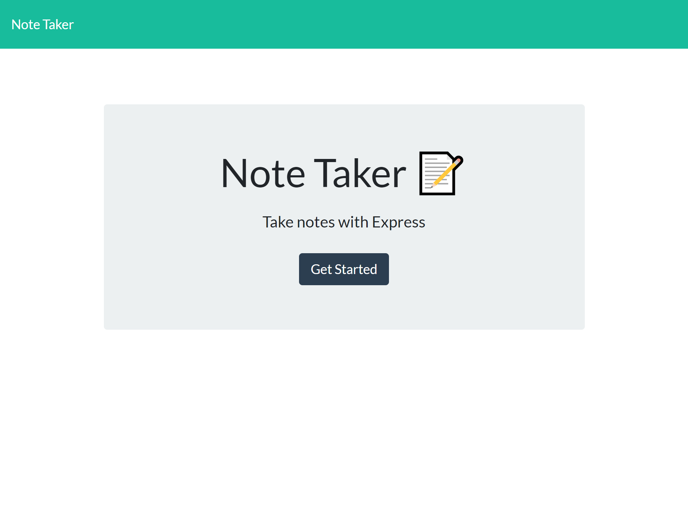

# Note_Taker

## Discription:

Note_Taker is a simple application that uses the functionality of the front end and back end togheter to allow a user to enter any notes/events/to-dos they would like and have it stored in the back end using Express.js. The front end was provided as starter code and our task was to code the back end and connect them both.

## Table of Contents

- [Usage](#usage)
- [Screenshot](#screenshot)
- [Skills](#skills)
- [License](#license)
- [Resources](#resources)

## Usage

To load the applicaiton click the link below then press "Get Started" to be directed to the page to write your first note. 

## Screenshot

## Skills

## License

License Documentation: (https://opensource.org/licenses/AFL-3.0)

## Resources
* Classmates: Mychal Martinez, Christain Go
* Week 11 - Hot Resturant class activity
* GitHub docs
* MDN web docs
* Stack overflow
